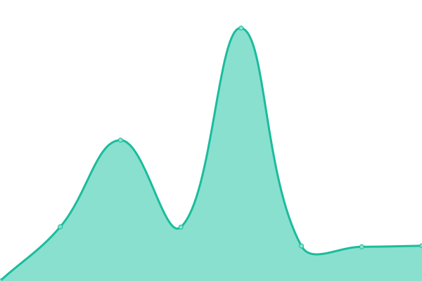
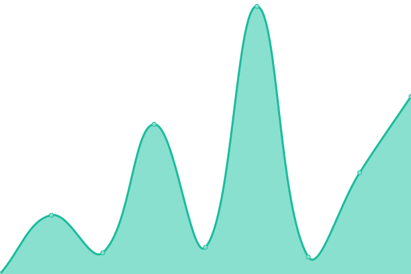
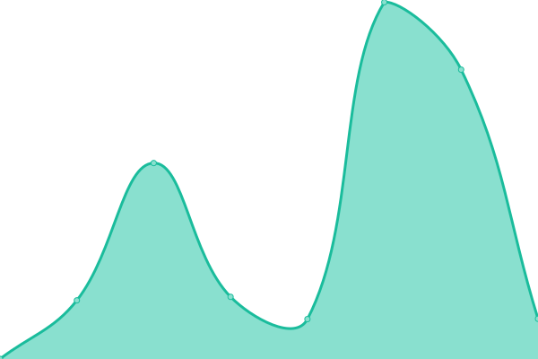

# [📈 Live Status](https://ESSS.github.io/upptime): <!--live status--> **🟧 Partial outage**

This repository contains the open-source uptime monitor and status page for [ESSS](http://www.esss.co), powered by [Upptime](https://github.com/upptime/upptime).

With [Upptime](https://upptime.js.org), you can get your own unlimited and free uptime monitor and status page, powered entirely by a GitHub repository. We use [Issues](https://github.com/ESSS/upptime/issues) as incident reports, [Actions](https://github.com/ESSS/upptime/actions) as uptime monitors, and [Pages](https://ESSS.github.io/upptime) for the status page.

<!--start: status pages-->
<!-- This summary is generated by Upptime (https://github.com/upptime/upptime) -->
<!-- Do not edit this manually, your changes will be overwritten -->
<!-- prettier-ignore -->
| URL | Status | History | Response Time | Uptime |
| --- | ------ | ------- | ------------- | ------ |
|  [RF-DAP (Demo)](https://rfdap-demo.esss.co) | 🟩 Up | [rf-dap-demo.yml](https://github.com/ESSS/upptime/commits/HEAD/history/rf-dap-demo.yml) | 

 1904ms
     
 | 

<a href="https://ESSS.github.io/upptime/history/rf-dap-demo">100.00%</a>
    

|  [RF-DAP (ESSS)](https://rfdap.esss.co) | 🟩 Up | [rf-dap-esss.yml](https://github.com/ESSS/upptime/commits/HEAD/history/rf-dap-esss.yml) | 

 1675ms
     
 | 

<a href="https://ESSS.github.io/upptime/history/rf-dap-esss">100.00%</a>
    

|  [RF-DAP (Shell)](https://shell-rfdap.esss.co) | 🟩 Up | [rf-dap-shell.yml](https://github.com/ESSS/upptime/commits/HEAD/history/rf-dap-shell.yml) | 

 1783ms
     
 | 

<a href="https://ESSS.github.io/upptime/history/rf-dap-shell">100.00%</a>
    

|  [RF-DAP (FASE Training)](https://fase-training.esss.co) | 🟩 Up | [rf-dap-fase-training.yml](https://github.com/ESSS/upptime/commits/HEAD/history/rf-dap-fase-training.yml) | 

 795ms
     
 | 

<a href="https://ESSS.github.io/upptime/history/rf-dap-fase-training">100.00%</a>
    

|  [RF-DAP (Trial)](https://rfdap-trial1.esss.co) | 🟩 Up | [rf-dap-trial.yml](https://github.com/ESSS/upptime/commits/HEAD/history/rf-dap-trial.yml) | 

 1350ms
     
 | 

<a href="https://ESSS.github.io/upptime/history/rf-dap-trial">100.00%</a>
    

|  [STORMS](https://storms.esss.co) | 🟩 Up | [storms.yml](https://github.com/ESSS/upptime/commits/HEAD/history/storms.yml) | 

 1120ms
     
 | 

<a href="https://ESSS.github.io/upptime/history/storms">100.00%</a>
    

|  [Atlantis](https://atlantis.esss.co) | 🟥 Down | [atlantis.yml](https://github.com/ESSS/upptime/commits/HEAD/history/atlantis.yml) | 

 0ms
     
 | 

<a href="https://ESSS.github.io/upptime/history/atlantis">0.00%</a>
    

<!--end: status pages-->

[**Visit our status website →**](https://ESSS.github.io/upptime)

## 📄 License

- Code: [MIT](./LICENSE) © [ESSS](http://www.esss.co)
- Data in the `./history` directory: [Open Database License](https://opendatacommons.org/licenses/odbl/1-0/)
